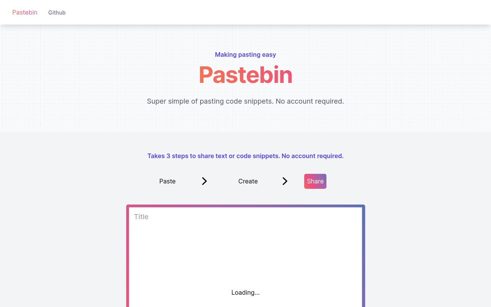

# [Paste](https://paste.laphel.com) - A simple pastebin clone

This is a simple pastebin clone built with Next.js and MongoDB.

This is an educational project to learn Next.js and MongoDB. It is not intended to be used in production.

[](https://vercel.com/new/clone?repository-url=https://github.com/turing0/paste-bin.git&env=SECRET_KEY,BASE_URL,MONGODB_URI&envDescription=These%20API%20keys%20are%20needed%20for%20the%20web%20app.%20The%20SECRET_KEY%20is%20used%20for%20encryption,%20the%20BASE_URL%20will%20be%20the%20URL%20of%20the%20app%20and%20MONGODB_URI%20is%20the%20connection%20string%20to%20your%20MongoDB%20instance.&project-name=paste-bin&repository-name=paste-bin&demo-title=Pastebin%20App%20&demo-description=A%20simple%20pastebin%20clone%20using%20Next.js%20and%20MongoDB.&demo-url=https://paste.laphel.com/&demo-image=https://paste.laphel.com/thumbnail.png&integration-ids=oac_jnzmjqM10gllKmSrG0SGrHOH)

[](https://paste.laphel.com)

## How it works
This application leverages Next.js and MongoDB to seamlessly store and retrieve user-submitted code snippets. Snippets are securely stored in a MongoDB database and can be conveniently accessed through a unique URL generated upon submission, with Next.js efficiently managing the MongoDB connection.

Also supports Dark/Light mode.

## Running Locally

### Cloning the repository the local machine.

```bash
git clone https://github.com/turing0/paste-bin.git
```
### Creating a account on MongoDB Atlass to get the connection string.

1. Create a free account on [MongoDB Atlass](https://www.mongodb.com/cloud/atlas/register).
2. Create a new cluster.
3. Create a new database user.
5. Get the connection string.

### Setting up the environment variables.

Create a file named `.env.local` in the root directory of the project. Add the following environment variables to the file.
```bash
SECRET_KEY= # A random string used for encryption.
BASE_URL= # The URL of the app.
MONGODB_URI= # The connection string to your MongoDB instance.
```

### Installing the dependencies.

```bash
npm install
```

### Running the application.

Then, run the application in the command line and it will be available at `http://localhost:3000`.

```bash
npm run dev
```

## One-Click Deploy

Deploy the example using [Vercel](https://vercel.com):

[](https://vercel.com/new/clone?repository-url=https://github.com/turing0/paste-bin.git&env=SECRET_KEY,BASE_URL,MONGODB_URI&envDescription=These%20API%20keys%20are%20needed%20for%20the%20web%20app.%20The%20SECRET_KEY%20is%20used%20for%20encryption,%20the%20BASE_URL%20will%20be%20the%20URL%20of%20the%20app%20and%20MONGODB_URI%20is%20the%20connection%20string%20to%20your%20MongoDB%20instance.&project-name=paste-bin&repository-name=paste-bin&demo-title=Pastebin%20App%20&demo-description=A%20simple%20pastebin%20clone%20using%20Next.js%20and%20MongoDB.&demo-url=https://paste.laphel.com/&demo-image=https://paste.laphel.com/thumbnail.png&integration-ids=oac_jnzmjqM10gllKmSrG0SGrHOH)

## License

This repo is MIT licensed.
